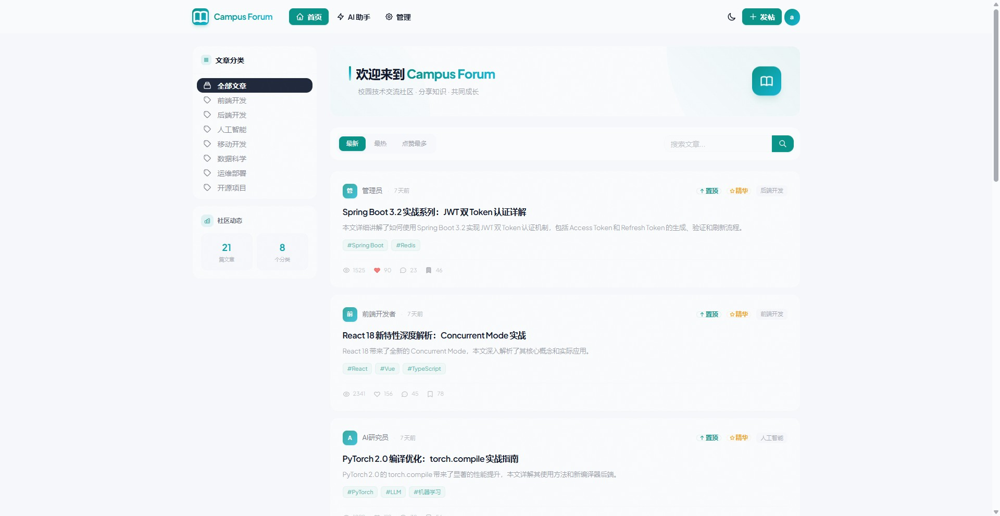
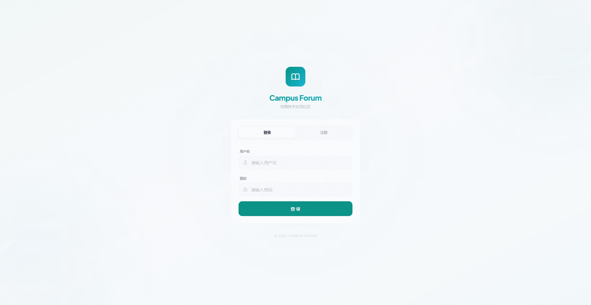
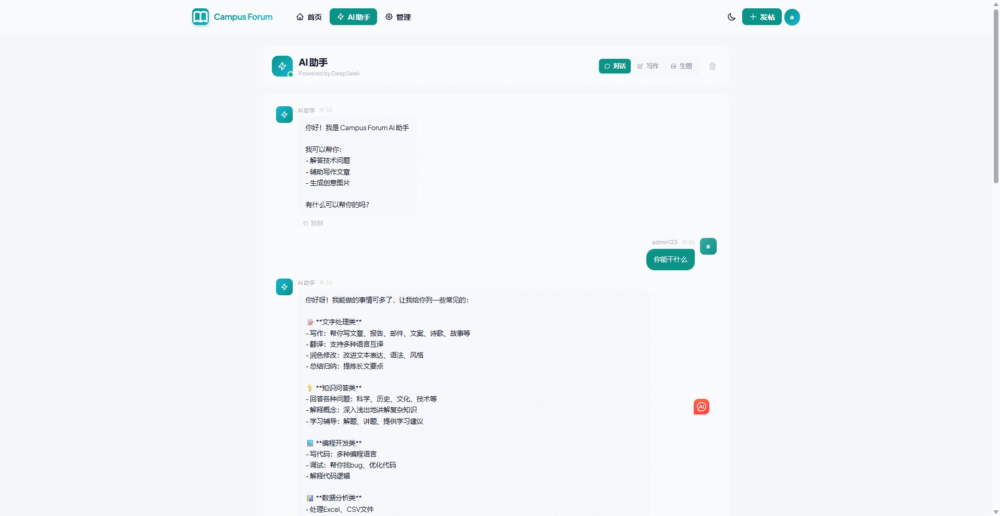
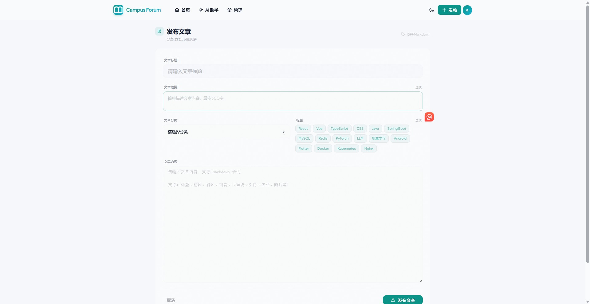
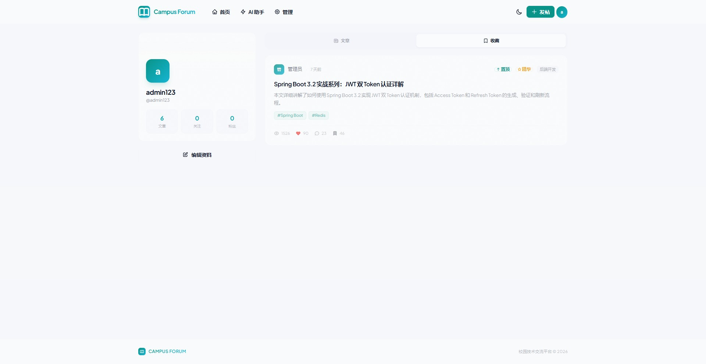
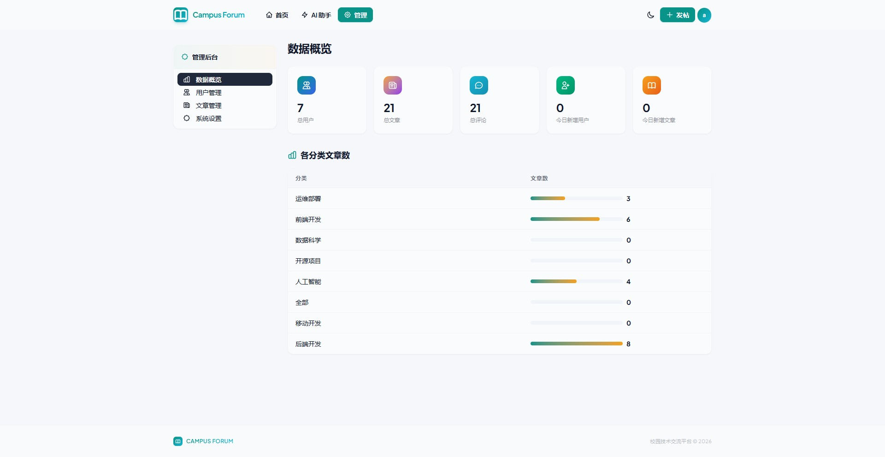

# Campus Forum - 校园论坛系统

一个现代化的校园论坛平台，采用前后端分离架构，支持文章发布、评论互动、AI智能助手等功能。

##  项目特色

- **AI 智能助手** - 集成 DeepSeek AI，支持聊天、写作辅助、图片生成
- **现代化 UI** - 采用 Editorial Minimal 设计风格，简约大气，适合年轻用户
- **完整功能** - 文章发布、评论互动、用户关注、收藏点赞等
- **响应式设计** - 适配多种设备，良好的移动端体验

##  技术栈

### 前端
- **框架**: React 18 + TypeScript
- **构建工具**: Vite
- **样式**: TailwindCSS + DaisyUI
- **路由**: React Router v6
- **状态管理**: Zustand
- **HTTP 客户端**: Axios

### 后端
- **框架**: Spring Boot 3.2
- **语言**: Java 17
- **数据库**: MySQL + Redis
- **认证**: JWT + Spring Security
- **ORM**: MyBatis-Plus
- **AI 集成**: LangChain4j + DeepSeek

##  项目结构

```
campus-forum/
├── frontend/                 # 前端项目
│   ├── src/
│   │   ├── components/       # 公共组件
│   │   ├── pages/           # 页面组件
│   │   ├── api/             # API 接口
│   │   ├── store/           # 状态管理
│   │   └── layouts/         # 布局组件
│   └── package.json
├── backend/                  # 后端项目
│   ├── src/main/java/       # Java 源码
│   └── src/main/resources/  # 配置文件
├── docker-compose.yml       # Docker 部署配置
└── README.md
```

##  快速开始

### 环境要求

- Node.js 18+
- JDK 17+
- MySQL 8.0+
- Redis 6.0+

### 后端启动

```bash
cd backend
mvn spring-boot:run
```

### 前端启动

```bash
cd frontend
npm install
npm run dev
```

### Docker 部署

```bash
docker-compose up -d
```

##  功能演示

### 主页


### 登录页面


### AI 助手


### 发布文章


### 个人主页


### 管理后台


## 🔧 配置说明

### AI 功能配置

在 `backend/src/main/resources/application.yml` 中配置：

```yaml
ai:
  api-key: your-deepseek-api-key
  base-url: https://api.deepseek.com
  model-name: deepseek-chat
```

### 数据库配置

```yaml
spring:
  datasource:
    url: jdbc:mysql://localhost:3306/campus_forum
    username: root
    password: your-password
```

##  API 接口

| 接口 | 方法 | 描述 |
|------|------|------|
| `/api/auth/login` | POST | 用户登录 |
| `/api/auth/register` | POST | 用户注册 |
| `/api/articles` | GET | 获取文章列表 |
| `/api/articles` | POST | 发布文章 |
| `/api/ai/chat` | POST | AI 聊天 |
| `/api/ai/image` | POST | AI 图片生成 |

##  设计规范

### 设计理念
- **Editorial Minimal** - 精致排版，极简风格
- 强调内容优先，减少视觉干扰
- 细腻的微交互和过渡动画

### 色彩系统
- **Primary**: #0d9488 (青色)
- **Secondary**: #f59e0b (琥珀色)
- **Accent**: #06b6d4 (天蓝色)

### 字体
- 主字体: Plus Jakarta Sans

##  License

MIT License

##  作者


##  致谢

- [React](https://react.dev/)
- [Spring Boot](https://spring.io/projects/spring-boot)
- [TailwindCSS](https://tailwindcss.com/)
- [DaisyUI](https://daisyui.com/)
- [DeepSeek](https://www.deepseek.com/)
